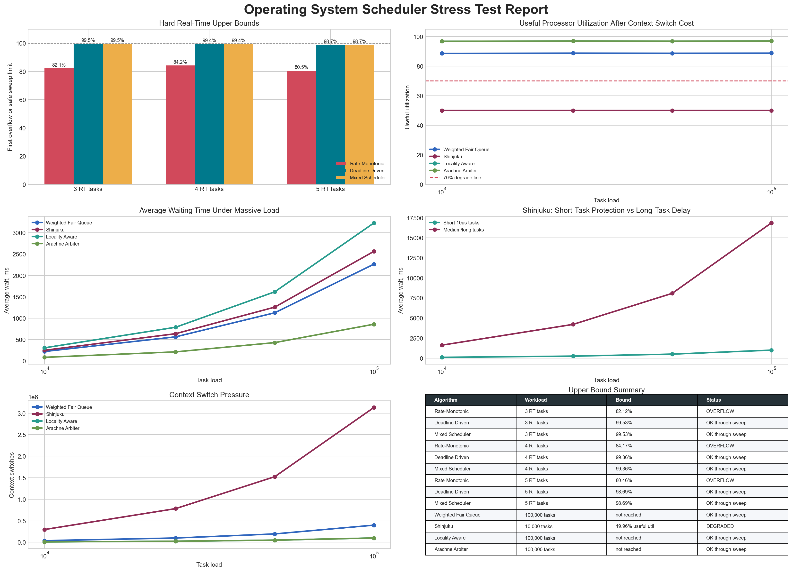
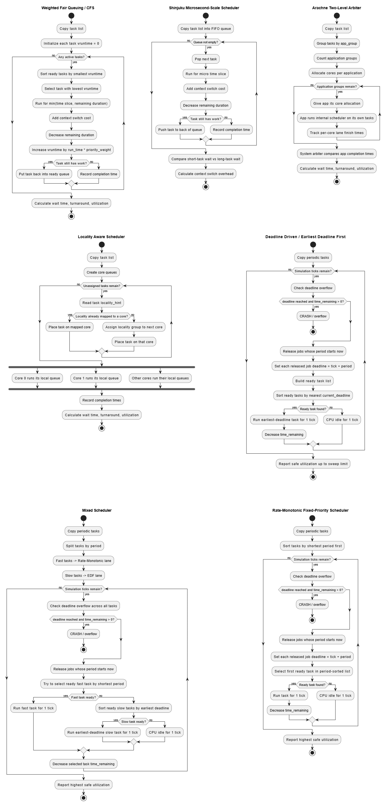

# Operating Systems Final Project

This project tests different operating system scheduling algorithms.

A scheduler decides which process gets to use the CPU next. This project creates fake process data, runs it through several scheduling algorithms, and shows where each algorithm starts to struggle.

## What Is Tested

### Modern schedulers

These are tested with very large numbers of fake tasks.

- **Weighted Fair Queue / CFS**: shares CPU time based on fairness.
- **Shinjuku**: uses very tiny time slices to keep short tasks from waiting too long.
- **Locality Aware**: keeps related tasks near the same CPU/cache area.
- **Arachne Arbiter**: gives CPU cores to app groups, then each app schedules its own work.

### Real-time schedulers

These are tested with strict deadlines.

- **Rate-Monotonic**: shorter-period tasks get higher priority.
- **Deadline Driven / EDF**: the task with the closest deadline runs first.
- **Mixed Scheduler**: fast tasks use Rate-Monotonic, slower tasks use EDF.

## Results Graph



This image shows the main results.

- **Hard Real-Time Upper Bounds**: shows when real-time schedulers miss deadlines.
- **Useful Processor Utilization**: shows how much CPU time is useful after context switching cost.
- **Average Waiting Time**: shows how long tasks wait as load increases.
- **Shinjuku Short vs Long Tasks**: shows that short tasks wait less, but long tasks wait much more.
- **Context Switch Pressure**: shows how many context switches each modern scheduler creates.
- **Upper Bound Summary**: quick table of which algorithms overflow or degrade.

## Algorithm Diagrams



This image shows the basic flow of each scheduler.

- **Weighted Fair Queue**: picks the task that has received the least fair CPU time.
- **Shinjuku**: cycles through tasks with very small time slices.
- **Arachne**: groups tasks by app and gives each app CPU cores.
- **Locality Aware**: places related tasks on the same core group.
- **EDF**: always runs the task with the closest deadline.
- **Mixed Scheduler**: uses one method for fast tasks and another for slower tasks.
- **Rate-Monotonic**: always favors tasks with shorter periods.

## Files

- `test_algos.py`: main simulation and graph generator.
- `scheduler_algorithms.puml`: PlantUML diagrams for the algorithms.
- `scheduler_stress_report.png`: generated result graph.
- `Scheduling_diagrams.drawio.png`: diagram image.

## How To Run

```bash
pip install -r requirements.txt
python test_algos.py
```

The script creates `scheduler_stress_report.png`.
